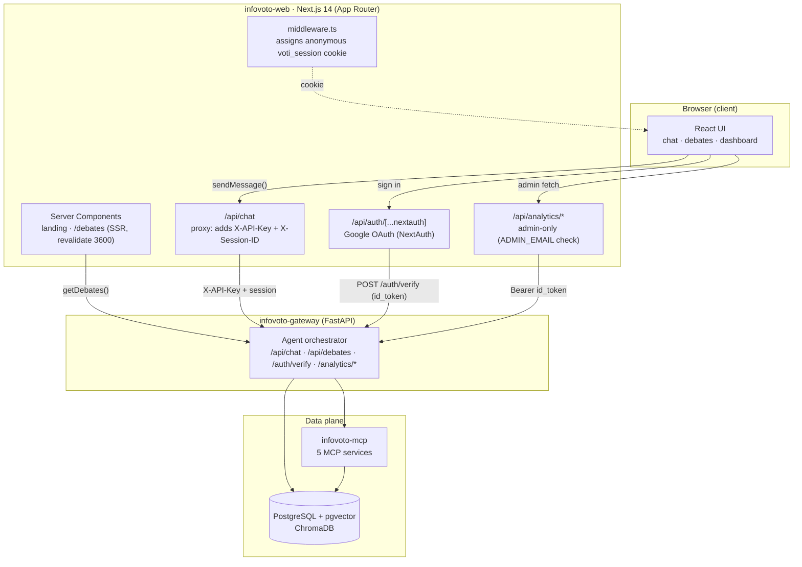

# InfoVoto Perú 2026 — Web (`infovoto-web`)

**A citizen electoral assistant for Peru's 2026 general election — the Next.js 14 frontend for "Voti".**

[](https://nextjs.org/)
[](https://www.typescriptlang.org/)
[](https://tailwindcss.com/)
[](https://next-auth.js.org/)
[](#license)

> Part of the **InfoVoto Perú 2026** project by [Cristian Lazo Quispe](https://github.com/CristianLazoQuispe) ([iDeepBrain](https://github.com/iDeepBrain)). Published as a research & engineering portfolio — for doctoral applications and for the civic-tech community.

---

## What it is

**Voti** is a non-partisan assistant that helps Peruvian voters understand the 2026 general election: who the candidates are, what their government plans say, their sworn asset declarations, judicial records, the presidential debates, and the logistics of voting itself. Every answer is meant to be traceable to an official source (JNE, ONPE, government plans) with explicit warnings when a statement comes from a sworn declaration or from AI interpretation.

`infovoto-web` is the **web client** of that system. It is a server-rendered Next.js 14 application (App Router) that provides:

- **Landing page** — a chat-first, trust-first entry point introducing Voti (a pixel-art "cyber-llama" mascot), the value proposition, a feature grid, a debates preview and a transparency/trust section.
- **Conversational chat** (`/chat`) — an open, no-login chat UI that talks to the Voti agent. Responses render markdown, source citations, transparency warnings and structured **candidate cards**. It ships with a rotating set of suggested questions in Spanish.
- **Presidential debates** (`/debates`, `/debates/[id]`) — server-rendered, publicly cached pages summarizing each JNE debate: participants, key points and an impartial analysis.
- **Admin analytics dashboard** (`/stats`) — a Google-authenticated, admin-only dashboard (built with Recharts) showing usage metrics: unique users, total queries, latency, per-day trends, estimated LLM cost and geo distribution.
- **Legal pages** (`/privacy`, `/terms`).

The app never talks to a database or an LLM directly. It calls the **gateway** service, which orchestrates the agent and the MCP data services.

---

## Architecture

The browser talks only to Next.js. Secrets (the gateway API key, admin bearer tokens) live server-side in Next.js API routes and never reach the client. Next.js then forwards requests to the **gateway**, which fans out to the MCP services and the database.



**Key real code paths:**

| Concern | File | Behaviour |
|---|---|---|
| Chat proxy | `app/api/chat/route.ts` | Injects `X-API-Key` (never exposed to browser) and the `voti_session` cookie as `X-Session-ID`, forwards to gateway `/api/chat` with a 20s timeout. |
| Typed gateway client | `lib/api.ts` | `sendMessage()` (via the proxy), `getDebates()` / `getDebate()` (direct, `next: { revalidate: 3600 }`), typed `ChatResponse`, `DebateDetail`, and typed error classes (`AuthError`, `RateLimitError`, `TimeoutError`, `GatewayError`). |
| Auth | `lib/auth.ts` | NextAuth Google provider → sends `id_token` to gateway `POST /auth/verify` → stores canonical `user_id` (Google `sub`) in the JWT; refreshes Google tokens before expiry. |
| Session cookie | `middleware.ts` | Assigns a per-visitor anonymous `voti_session` UUID cookie (used by the gateway for rate-limiting and analytics) on `/chat/*` and `/api/chat`. |
| Admin analytics | `app/api/analytics/*/route.ts` | Server-side `getServerSession` + `ADMIN_EMAIL` allow-list, forwards the `id_token` as a Bearer token to gateway `/analytics/*`. |

---

## What it demonstrates

This repo is a compact showcase of a production-shaped Next.js application:

- **App Router & Server Components** — SSR landing and debates pages; `revalidate`-based caching for public content; `force-dynamic` where freshness matters.
- **Secure server-side proxying** — API keys and admin bearer tokens are added inside Next.js API routes, so no privileged credential is ever shipped to the browser.
- **OAuth authentication** — Google sign-in via NextAuth with a custom JWT/session callback that reconciles identity with the backend (`/auth/verify`) and handles token refresh.
- **Server-enforced authorization** — the analytics dashboard is gated by a server-side `ADMIN_EMAIL` check, not by client-side hiding.
- **Streaming-ready chat UI** — a typed client, per-request timeouts/aborts, structured error handling, markdown rendering with XSS sanitization, and an SSE client (`sendMessageStream`) scaffolded for progressive responses.
- **Data visualization** — Recharts line/bar charts for a bilingual (ES/EN) metrics dashboard.
- **Hardening** — CSP, `X-Frame-Options`, `nosniff`, `Referrer-Policy`, `Permissions-Policy` and CORS configured in `next.config.mjs`; a non-root, standalone Docker image.
- **Design & motion** — Tailwind CSS, framer-motion, and a hand-drawn pixel-art identity (Voti) with Aseprite sources under `assets/`.

---

## Tech stack

| Layer | Technology |
|---|---|
| Framework | Next.js 14 (App Router, `output: "standalone"`) |
| Language | TypeScript 5 |
| Styling | Tailwind CSS 3.4 + `@tailwindcss/typography` |
| Auth | NextAuth.js 4 (Google OAuth) |
| Animation | framer-motion 12 |
| Charts | Recharts 3 |
| Testing | Vitest (unit) + Playwright (e2e / visual) |
| Runtime | Node.js 20 (Alpine) |

---

## Project structure

```
infovoto-web/
├── app/
│   ├── page.tsx                     # public landing (composes the sections below)
│   ├── layout.tsx                   # root layout + session provider + analytics
│   ├── chat/page.tsx                # open conversational chat UI
│   ├── debates/
│   │   ├── page.tsx                 # SSR list of presidential debates
│   │   └── [id]/page.tsx            # single debate detail + analysis
│   ├── stats/page.tsx               # admin analytics dashboard (Recharts)
│   ├── admin/page.tsx               # hidden entry → Google login → /stats
│   ├── (auth)/login/page.tsx        # Google sign-in
│   ├── (legal)/privacy · terms      # legal pages
│   ├── components/                  # Hero, Navbar, Footer, CandidateCard, VotiSprite, …
│   └── api/
│       ├── chat/route.ts            # server proxy to gateway /api/chat
│       ├── auth/[...nextauth]/      # NextAuth handler
│       └── analytics/{stats,daily-stats,geo-stats}/route.ts
├── lib/
│   ├── api.ts                       # typed gateway client + error types
│   ├── auth.ts                      # NextAuth config + /auth/verify integration
│   └── logger.ts                    # structured logger
├── middleware.ts                    # anonymous session cookie
├── next.config.mjs                  # standalone build + security headers + CSP
├── Dockerfile                       # multi-stage, non-root standalone image
└── Makefile                         # local dev shortcuts
```

---

## Local setup

**Prerequisites:** Node.js 20+ and a Google OAuth client (Client ID / Secret).

```bash
# 1. Install
npm install            # or: make install

# 2. Configure environment
cp .env.local.example .env.local     # fill in your own values

# 3. Run the dev server (http://localhost:3000)
npm run dev            # or: make dev

# 4. Production build (also type-checks)
npm run build          # or: make build

# 5. Lint
npm run lint

# Tests
npm run test           # Vitest unit tests
npm run test:e2e       # Playwright end-to-end
```

Under Docker Compose (in `infovoto-infra`) the app is exposed on **`localhost:2300`** (mapped to container port 3000), the gateway on `localhost:2080`.

### Environment variables

The chat page and debates work without login; only the analytics dashboard requires OAuth. Use your **own** credentials — never commit real values.

| Variable | Purpose |
|---|---|
| `GOOGLE_CLIENT_ID` | Google OAuth client ID |
| `GOOGLE_CLIENT_SECRET` | Google OAuth client secret *(secret)* |
| `NEXTAUTH_SECRET` | NextAuth JWT/session signing key *(secret)* |
| `NEXTAUTH_URL` | Public app URL (e.g. `http://localhost:2300`) |
| `NEXT_PUBLIC_GATEWAY_URL` | Gateway URL exposed to the browser (build-time) |
| `GATEWAY_URL` | Server-only gateway URL for the proxy routes |
| `GATEWAY_API_KEY_WEB` | Gateway API key, server-side only — never `NEXT_PUBLIC_` *(secret)* |
| `ADMIN_EMAIL` | Allow-listed email for the analytics dashboard *(placeholder — use your own)* |
| `NEXT_PUBLIC_GA_ID` | Google Analytics 4 measurement ID (optional) |
| `NEXT_PUBLIC_ASSETS_URL` | Base URL for static/pixel-art assets (optional) |

---

## Live demo / Status

The **landing page is kept live at [voti.pe](https://voti.pe)** as a public portfolio showcase of the product and its design.

To keep hosting costs at zero outside the election window, the **interactive chatbot and the backend services (gateway, MCP, database) are archived / decommissioned.** As a result, the live chat, debates data and analytics dashboard are not served in real time. The **full source code is public here** so the complete application — including the conversational flows — can be read, reviewed and run locally against a self-hosted backend.

> In short: *public code, a full-featured web app, a live landing demo — with the interactive backend archived for cost reasons.*

---

## Related repositories

Part of the **InfoVoto Perú 2026** system under the [`iDeepBrain`](https://github.com/iDeepBrain) organization:

| Repo | Role |
|---|---|
| [`infovoto-web`](https://github.com/iDeepBrain/infovoto-web) | **This repo** — Next.js 14 frontend (landing, chat, debates, dashboard) |
| [`infovoto-gateway`](https://github.com/iDeepBrain/infovoto-gateway) | FastAPI gateway + LLM agent + Google OAuth verification |
| [`infovoto-mcp`](https://github.com/iDeepBrain/infovoto-mcp) | Five MCP data services (profiles, plans, logistics, oversight, financing) |
| [`infovoto-scraper`](https://github.com/iDeepBrain/infovoto-scraper) | Batch scraping jobs that populate the database |
| [`infovoto-infra`](https://github.com/iDeepBrain/infovoto-infra) | Docker Compose, Makefiles and operational scripts |
| [`infovoto-planning`](https://github.com/iDeepBrain/infovoto-planning) | Epics, roadmap and per-repo task tracking |
| [`infovoto-docs`](https://github.com/iDeepBrain/infovoto-docs) | Research notes, product docs and user guides |

---

## License

Released under the **MIT License**. See [`LICENSE`](LICENSE) for details.

**Author:** Cristian Lazo Quispe — [github.com/CristianLazoQuispe](https://github.com/CristianLazoQuispe)

---
---

## Español

**Un asistente electoral ciudadano para las Elecciones Generales de Perú 2026 — el frontend Next.js 14 de "Voti".**

> Parte del proyecto **InfoVoto Perú 2026** de [Cristian Lazo Quispe](https://github.com/CristianLazoQuispe) ([iDeepBrain](https://github.com/iDeepBrain)). Publicado como portafolio de investigación e ingeniería — para postulaciones doctorales y para la comunidad de tecnología cívica.

### Qué es

**Voti** es un asistente imparcial que ayuda a los votantes peruanos a entender las elecciones 2026: quiénes son los candidatos, qué dicen sus planes de gobierno, sus declaraciones juradas de patrimonio, antecedentes judiciales, los debates presidenciales y la logística del voto. Cada respuesta busca ser trazable a una fuente oficial (JNE, ONPE, planes de gobierno), con advertencias explícitas cuando un dato proviene de una declaración jurada o de una interpretación de la IA.

`infovoto-web` es el **cliente web** del sistema. Es una aplicación Next.js 14 (App Router) renderizada en el servidor que ofrece:

- **Landing** — punto de entrada "chat-first" y "trust-first" que presenta a Voti (una mascota pixel-art, una "cyber-llama"), la propuesta de valor, una grilla de funciones, un preview de debates y una sección de transparencia.
- **Chat conversacional** (`/chat`) — una interfaz de chat abierta y sin login que conversa con el agente Voti. Renderiza markdown, citas de fuentes, advertencias de transparencia y **tarjetas de candidatos** estructuradas, con preguntas sugeridas rotativas.
- **Debates presidenciales** (`/debates`, `/debates/[id]`) — páginas renderizadas en el servidor y cacheadas que resumen cada debate del JNE: participantes, puntos clave y un análisis imparcial.
- **Dashboard de analítica (admin)** (`/stats`) — un panel solo para administradores, autenticado con Google y construido con Recharts: usuarios únicos, consultas totales, latencia, tendencias por día, costo estimado de LLM y distribución geográfica.
- **Páginas legales** (`/privacy`, `/terms`).

La app nunca accede directamente a una base de datos ni a un LLM: llama al servicio **gateway**, que orquesta el agente y los servicios MCP.

### Arquitectura

El navegador solo habla con Next.js. Los secretos (API key del gateway, tokens de admin) viven en el servidor, dentro de las rutas API de Next.js, y **nunca llegan al cliente**. Next.js reenvía las solicitudes al **gateway**, que a su vez consulta los servicios MCP y la base de datos. Ver el diagrama Mermaid y la tabla de rutas en la sección en inglés.

**Rutas de código reales clave:**

| Aspecto | Archivo | Comportamiento |
|---|---|---|
| Proxy de chat | `app/api/chat/route.ts` | Inyecta `X-API-Key` (nunca expuesta al navegador) y la cookie `voti_session` como `X-Session-ID`; reenvía a `/api/chat` del gateway con timeout de 20s. |
| Cliente tipado | `lib/api.ts` | `sendMessage()` (vía proxy), `getDebates()` / `getDebate()` (directo, `revalidate: 3600`), tipos y clases de error (`AuthError`, `RateLimitError`, `TimeoutError`, `GatewayError`). |
| Autenticación | `lib/auth.ts` | Google (NextAuth) → envía el `id_token` a `POST /auth/verify` del gateway → guarda el `user_id` canónico (Google `sub`) en el JWT; refresca tokens antes de expirar. |
| Cookie de sesión | `middleware.ts` | Asigna una cookie anónima `voti_session` (UUID) usada por el gateway para rate-limiting y analítica. |
| Analítica admin | `app/api/analytics/*/route.ts` | Verificación server-side con `getServerSession` + lista blanca `ADMIN_EMAIL`; reenvía el `id_token` como Bearer a `/analytics/*`. |

### Qué demuestra

Muestra una app Next.js con forma de producción: **App Router y Server Components** (SSR + caché por `revalidate`), **proxy seguro en el servidor** (las API keys nunca se envían al navegador), **OAuth con Google** (NextAuth con callbacks de JWT/sesión y refresh de tokens), **autorización server-side** (dashboard restringido por `ADMIN_EMAIL`), **UI de chat lista para streaming** (cliente tipado, timeouts/abortos, manejo de errores, markdown con sanitización XSS, cliente SSE `sendMessageStream`), **visualización de datos** (Recharts, bilingüe ES/EN) y **hardening** (CSP y cabeceras de seguridad en `next.config.mjs`, imagen Docker standalone sin root).

### Stack

Next.js 14 (App Router, `output: "standalone"`) · TypeScript 5 · Tailwind CSS 3.4 · NextAuth.js 4 (Google OAuth) · framer-motion 12 · Recharts 3 · Vitest + Playwright · Node.js 20.

### Puesta en marcha local

**Requisitos:** Node.js 20+ y un cliente OAuth de Google.

```bash
npm install                          # o: make install
cp .env.local.example .env.local     # completar con tus propios valores
npm run dev                          # http://localhost:3000  (o: make dev)
npm run build                        # build de producción (verifica TypeScript)
npm run lint
npm run test                         # Vitest
npm run test:e2e                     # Playwright
```

Con Docker Compose (en `infovoto-infra`), la app se expone en **`localhost:2300`** y el gateway en `localhost:2080`. Las variables de entorno están documentadas en la tabla de la sección en inglés — el chat y los debates funcionan sin login; solo el dashboard requiere OAuth. **Usa tus propias credenciales y nunca subas valores reales.**

### Demo en vivo / Estado

La **landing se mantiene en vivo en [voti.pe](https://voti.pe)** como vitrina pública de portafolio.

Para mantener el costo de hosting en cero fuera de la ventana electoral, el **chatbot interactivo y los servicios de backend (gateway, MCP, base de datos) están archivados / dados de baja.** Por eso el chat en vivo, los datos de debates y el dashboard no se sirven en tiempo real. El **código fuente completo es público** aquí, de modo que toda la aplicación pueda leerse, revisarse y ejecutarse localmente contra un backend propio.

> En resumen: *código público, una web app completa, una landing demo en vivo — con el backend interactivo archivado por costos.*

### Licencia

Publicado bajo licencia **MIT**. **Autor:** Cristian Lazo Quispe — [github.com/CristianLazoQuispe](https://github.com/CristianLazoQuispe)
